# Contributing
Here's how to contribute.
This document is a *very* rough draft for now, just so you can get started.

There are two main ways you can contribute to the documents:
- [Use GitHub Directly](#use-github-directly)
  - [Create a New File in GitHub](#create-a-new-file-in-github)
  - [Edit an Existing File in GitHub](#edit-an-existing-file-in-github)
- [Use VSCode](#use-vscode)

## Use GitHub Directly
1. Go to the main page for this repo.
   - https://github.com/ryanjob42/Riviera-Documentation
2. Click the "Branch" button near the top left.

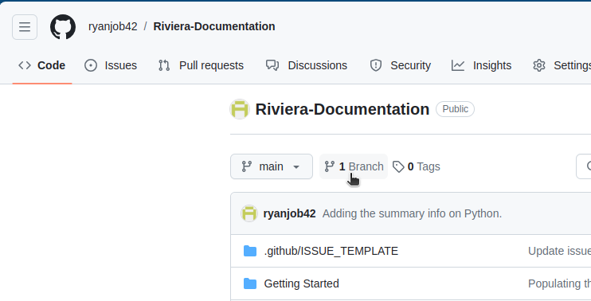

3. Click the "New branch" button near the top right.

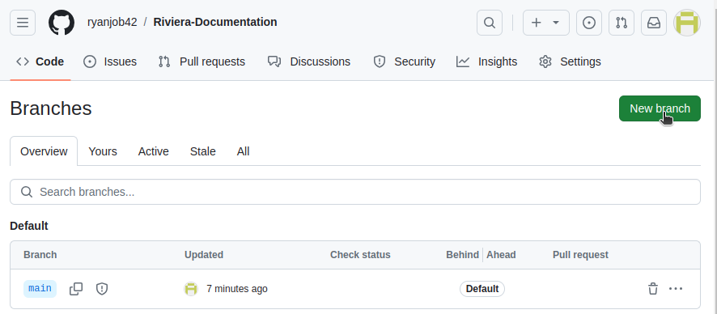

4. Give the branch a name (all lowercase, and use a hyphen instead of a space).
5. Keep the source as "main", and click "Create new branch".

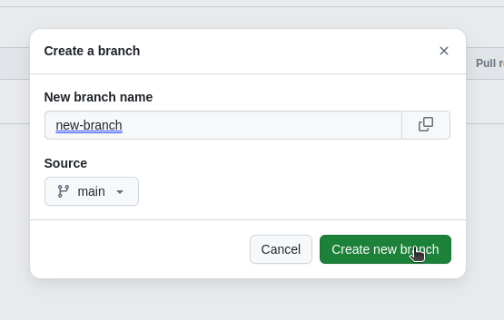

6. Click on the new branch you created.

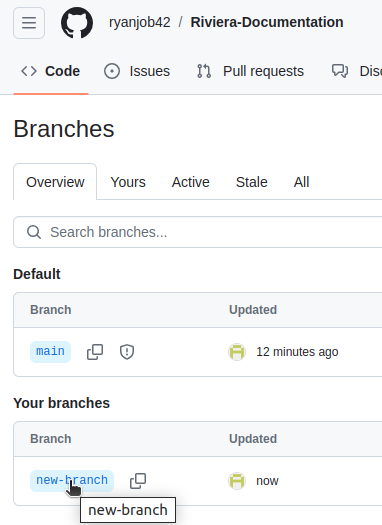

7. This will bring you back to something that looks like the main page, but it'll say your branch name near the top left instead of "main".

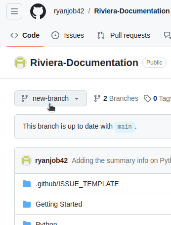

### Create a New File in GitHub
How to create a new file directly in GitHub.

1. If you want to add something inside a folder that already exists, navigate to where you want the file to be.
   1. If you want it in a folder that doesn't exist, stay on the main page.
2. Use the "Add file" button near the top center/right and select "Create new file".

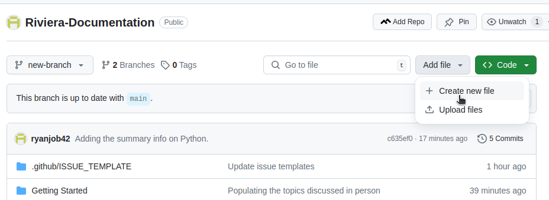

3. Give your file a name.
   1. If you want it in a folder, write the folder name exactly as you want it (spaces and capitalization are important), then write a "/" after it. The UI will update to show the folder.

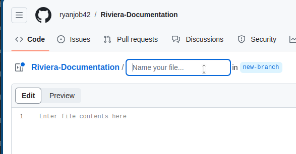

4. Write what you want in the file.
   1. The first line should start with "#" and the title of the file (which should match the file name).
   2. Sections should start with "##" and the name of the section.
   3. Subsections use "###", and so on.
5. Use the "Edit" and "Preview" buttons on the top left to switch between changing your file and seeing what it will look like.

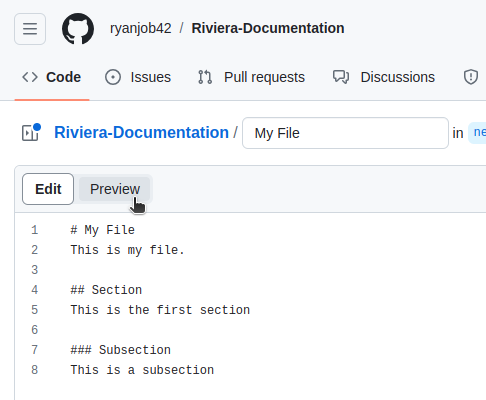

6. Use the "Commit changes..." button at the top right to save your changes.

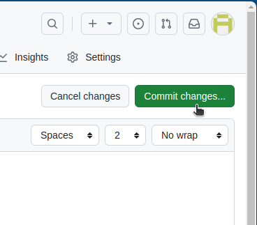

7. You can use the "commit message" as a quick summary (only a few words) and the "extended description" for a slightly longer summary (only a few sentences).
   1. It's OK to just leave them alone too if you don't want to bother.
8. Click the "Commit changes" button (bottom right of the mini window).

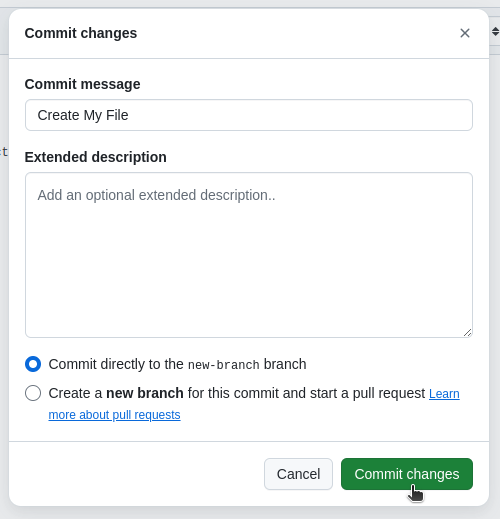

9. When you're done making all the changes you want, on the main page, click the "Contribute" button near the top right, then select "Open pull request".

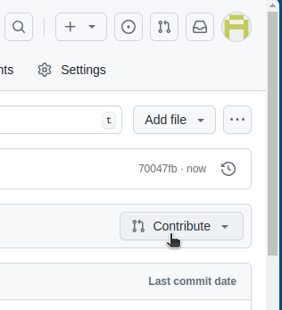

10. Add a title and description if you want, then click "Create pull request" near the bottom right.

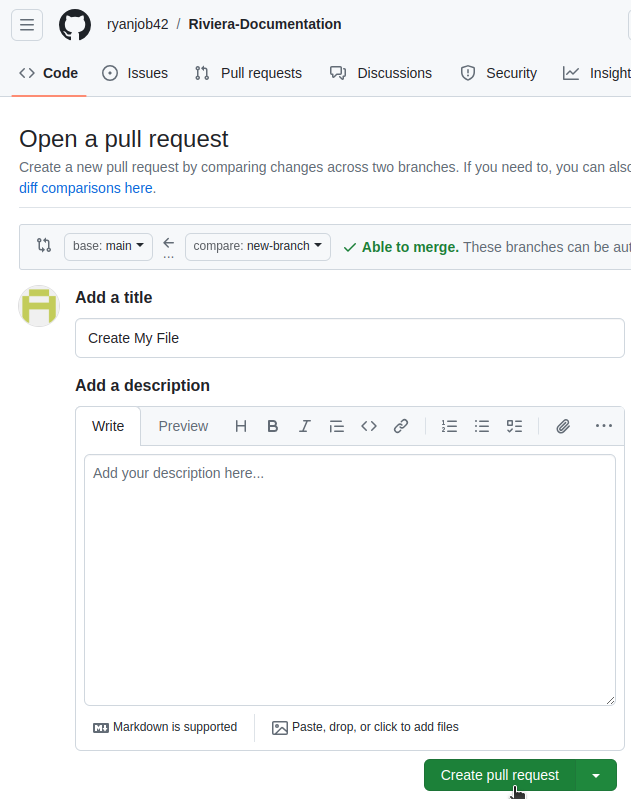

11. Let Ryan know that you've created the pull request, and he will review it.

### Edit an Existing File in GitHub
This is basically the same as creating a new file.
Instead of using the "Add file" button (step 2), simply find the file and use the pencil icon that says "Edit this file" when you hover over it (top right).

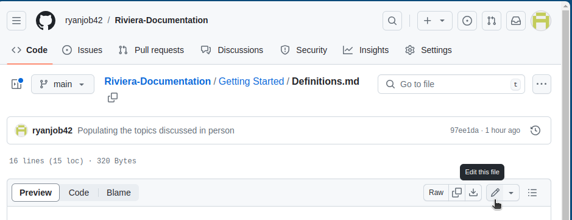

## Use VSCode
1. Clone the repository with the command line.
   1. `git clone git@github.com:ryanjob42/Riviera-Documentation.git`.
   2. This creates a folder called "Riviera-Documentation" wherever your terminal is.
   3. Feel free to rename the top-level folder if you'd like.
2. Go into the folder with `cd Riviera-Documentation` (or the folder name if you renamed it).
3. Use `git checkout -b branch-name` to create a new branch (replacing "branch-name" with the name of your branch).
   1. Branch names should be all lowercase and use hyphens ("-") instead of spaces.
4. Open the folder with VSCode.
   1. Open VSCode, then use "File > Open folder".
5. Make all the changes you want.
6. In the terminal, use `git add -A` to "stage" all the changes (i.e., tell git that you want to submit those changes).
7. Use `git commit` to have git help you "commit" (finalize) the changes.
   1. This will open a text editor (maybe `vim` or `nano`).
   2. The first line is supposed to be your very short summary (80 characters is the suggested max).
   3. All lines after that is the optional longer description (aside from those starting with a "#", which is a comment).
   4. Save the file and exit the editor to continue on.
   5. Alternatively, use the `git commit -m "Short message here"` to skip the editor and just give the short description.
8. Use `git push` to push the changes to GitHub.
   1. The first time you do this, git will probably yell at you and say something about a missing "upstream".
   2. Part of that message will contain the command that it actually wants you to run.
   3. Just copy/paste that command (or rewrite it exactly as shown) to make git happy.
   4. This should just be a one-time thing.
9. Once you've made all the changes you want, use the GitHub site to create a pull request.
